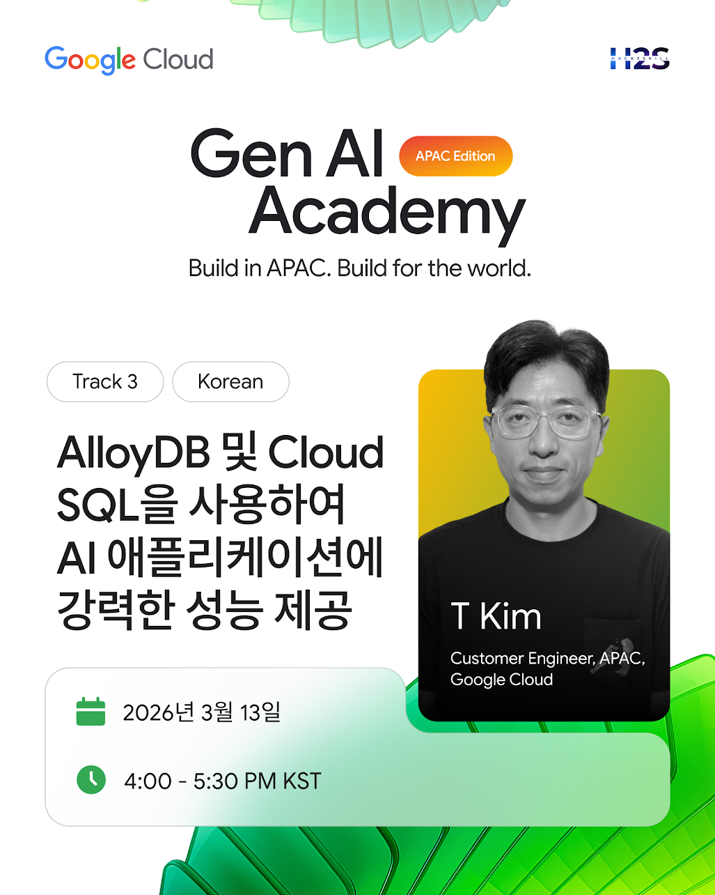

# GenAI Academy 2026

## Documentation
* [Step-by-Step Guide: GenAI_Academy_2026_Track 3_Step-by-Step_Hands-on_Guide.pdf](https://github.com/aimldl/genai-academy-2026/blob/main/GenAI_Academy_2026_Track%203_Step-by-Step_Hands-on_Guide.pdf)

## Test Images
Refer to the [item-images](https://github.com/aimldl/genai-academy-2026/tree/main/item-images) directory for sample image files for application testing.

## Related Links

### Codelabs
* [AlloyDB Quick Setup Lab](https://codelabs.developers.google.com/quick-alloydb-setup)
* [Building a Real-Time Surplus Engine with Gemini 3 Flash & AlloyDB](https://codelabs.developers.google.com/gemini-3-flash-on-alloydb-sustainability-app)

* 🇰🇷 [AlloyDB 빠른 설정 실습](https://codelabs.developers.google.com/quick-alloydb-setup)
* 🇰🇷 [Gemini 3 Flash 및 AlloyDB로 실시간 잉여 엔진 빌드](https://codelabs.developers.google.com/gemini-3-flash-on-alloydb-sustainability-app?hl=ko&authuser=1#0)
